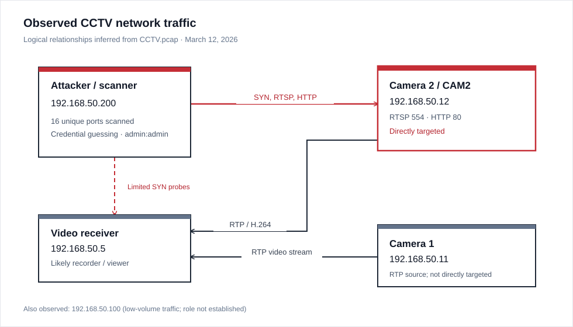
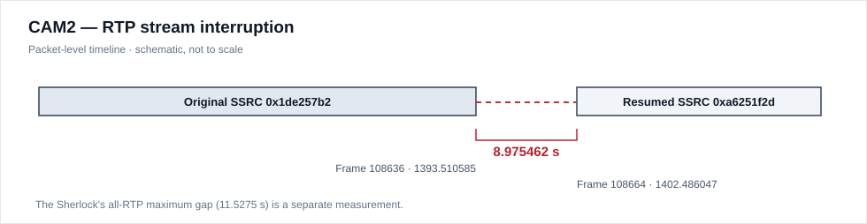
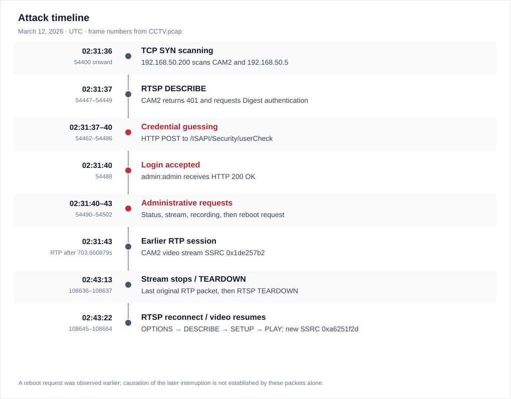

# NoSignal - Sherlock Writeup


*A CCTV network-forensics investigation covering service reconnaissance, camera authentication attempts, and an interrupted video stream.*

by: Brandon Chaney

## Executive Summary

This Sherlock starts with a suspicious network capture from an internal CCTV environment. Cameras were reportedly behaving strangely, including stream interruptions and restarts. I was given `CCTV.pcap` and tasked with identifying the attacker, the affected camera, and what actually happened on the network.

The traffic points to **`192.168.50.200`** scanning the environment before directly contacting camera **`192.168.50.12` (CAM2)** over RTSP. After an initial `401 Unauthorized` response, the attacker moved to HTTP credential guessing. Several combinations were rejected before **`admin:admin`** received a `200 OK`. The attacker then accessed camera status endpoints, issued a recording command, and requested a reboot.

Camera `.12` later stopped sending RTP packets, underwent an RTSP `TEARDOWN`, and resumed with a different SSRC. The camera-specific gap between its last and first RTP packets was **8.975 seconds**. A separate calculation across *all* RTP traffic returned **11.5275 seconds**; these are different measurements and should not be treated as the same outage without matching their packet boundaries.

> Using TShark, HTTP/RTSP headers, RTP sequence information, and packet timestamps, this investigation reconstructs the observed activity without relying on application logs.

## Evidence & Affected Systems

| IP | Observed role | Evidence |
| --- | --- | --- |
| `192.168.50.200` | Attacker / scanner | Multiple TCP SYN probes, RTSP request, HTTP authentication attempts |
| `192.168.50.12` | Targeted CCTV camera (CAM2) | RTSP `554`, HTTP `80`, RTP video, authentication and administrative responses |
| `192.168.50.11` | Other CCTV camera | RTP stream sent to `.5`; no direct attacker access established here |
| `192.168.50.5` | Video receiver / likely recorder | Large RTP transfers from both cameras; also received limited probes from attacker |
| `192.168.50.100` | Other network host | Low-volume traffic; role not established |



## Reconnaissance: Finding the Attacker

To start, I needed to find the IP responsible for the recon. I used TShark to see who sent the most initial TCP SYN packets, since these can help identify port scanning.

```bash
tshark -r CCTV.pcap \
-Y "tcp.flags.syn == 1 && tcp.flags.ack == 0" \
-T fields -e ip.src | sort | uniq -c | sort -nr
```

```text
21 192.168.50.200
 3 192.168.50.5
 1 192.168.50.100
```

`.200` stood out. What matters more than the count, though, is *where* those packets went. Looking at the source, destination, and ports showed attempts against camera `.12` and host `.5`:

```bash
tshark -r CCTV.pcap \
-Y "ip.src == 192.168.50.200 && tcp.flags.syn == 1 && tcp.flags.ack == 0" \
-T fields -e ip.src -e ip.dst -e tcp.dstport
```

```text
192.168.50.200  192.168.50.12  21
192.168.50.200  192.168.50.12  22
192.168.50.200  192.168.50.12  23
192.168.50.200  192.168.50.12  80
192.168.50.200  192.168.50.12  445
192.168.50.200  192.168.50.12  554
192.168.50.200  192.168.50.12  8080
192.168.50.200  192.168.50.5   3306
```

*Selected packets only.* The scan covered FTP, SSH, Telnet, web interfaces, SMB, and RTSP on port `554`. To avoid counting the same port more than once:

```bash
tshark -r CCTV.pcap \
-Y "ip.src == 192.168.50.200 && tcp.flags.syn == 1 && tcp.flags.ack == 0" \
-T fields -e tcp.dstport | sort -n | uniq | wc -l
# 16
```

I also checked IPv4 conversations using `tshark -r CCTV.pcap -q -z conv,ip`. Despite the many probes, `.200` exchanged only about **11 kB** with `.12` and **540 bytes** with `.5`, compared to the much larger camera-to-receiver RTP flows. That fits reconnaissance, but the spread of destination ports is the stronger evidence.

## Direct RTSP Access & Authentication Challenge

Next I wanted to see whether the attacker actually interacted with a camera service, rather than just scanning port `554`. Decoding the RTSP traffic showed a `DESCRIBE` request directed at `.12`.

```bash
tshark -r CCTV.pcap \
-d tcp.port==554,rtsp \
-Y "rtsp && ip.addr == 192.168.50.200"
```

```text
54447  696.973114  192.168.50.200 → 192.168.50.12  RTSP  DESCRIBE rtsp://192.168.50.12:554/Streaming/Channels/101 RTSP/1.0
54449  696.999937  192.168.50.12 → 192.168.50.200  RTSP  Reply: RTSP/1.0 401 Unauthorized
```

To get the actual timestamp instead of seconds since capture start:

```bash
tshark -r CCTV.pcap \
-d tcp.port==554,rtsp \
-Y "ip.src == 192.168.50.200 && rtsp.request" \
-T fields -e frame.number -e frame.time -e rtsp.method
```

```text
54447  Mar 12, 2026 02:31:37.045849000 UTC  DESCRIBE
```

The `401` meant access was not granted by that request. I inspected the response header to identify the authentication mechanism:

```bash
tshark -r CCTV.pcap \
-d tcp.port==554,rtsp \
-Y "ip.src == 192.168.50.12 && rtsp" \
-V | grep -i "WWW-Authenticate"
```

```text
WWW-Authenticate: Digest realm="IP Camera(CAM2)", nonce="98ab01a7f0", qop="auth"
```

So the camera requested **Digest authentication**. This header also gave us the camera's `CAM2` identifier. Digest itself doesn't expose the password in plaintext, but there was more to find in the subsequent HTTP traffic.

## HTTP Credential Guessing & Successful Login

Brute-force-style login attempts were later visible in requests to `/ISAPI/Security/userCheck`. I searched the attacker's TCP payloads for relevant authentication strings:

```bash
tshark -r CCTV.pcap \
-Y "ip.src == 192.168.50.200 && tcp.len > 0" \
-T fields -e tcp.payload | xxd -r -p | strings \
| grep -iE "password|passwd|username|authorization"
```

The XML request bodies exposed the attempted combinations:

| Username | Password | Observed result |
| --- | --- | --- |
| `admin` | `12345` | `403 Forbidden` |
| `admin` | `password` | `403 Forbidden` |
| `admin` | `camera` | `403 Forbidden` |
| `admin` | `hikvision` | `403 Forbidden` |
| `root` | `root` | `403 Forbidden` |
| `service` | `service` | `403 Forbidden` |
| **`admin`** | **`admin`** | **`200 OK`** |

For example, the final submitted credentials appeared as:

```xml
<UserCheck><userName>admin</userName><password>admin</password></UserCheck>
```

I checked the HTTP response sequence to confirm that the final POST lined up with the successful response. The **first credential-guessing POST occurs at frame `54462`**—the clearest move from reconnaissance into exploitation activity.

```bash
tshark -r CCTV.pcap \
-Y 'http.request || http.response' \
-T fields -e frame.number -e frame.time -e ip.src -e ip.dst \
-e http.request.method -e http.request.uri -e http.response.code
```

```text
54486  02:31:40.395100 UTC  192.168.50.200 → 192.168.50.12  POST /ISAPI/Security/userCheck
54488  02:31:40.437751 UTC  192.168.50.12 → 192.168.50.200  200
54490  02:31:40.816757 UTC  192.168.50.200 → 192.168.50.12  GET /ISAPI/System/status
54492  02:31:40.852882 UTC  192.168.50.12 → 192.168.50.200  200
```

*Timestamp formatting abbreviated above.* Several prior attempts returned `403`, while the `admin:admin` request received `200 OK`. The follow-on activity supports that the attacker now had usable access.

## Post-Authentication Camera Activity

After authenticating, the attacker didn't stop at checking the stream. More HTTP requests were directed at the camera:

| Frame | Request | Response |
| --- | --- | --- |
| `54490` | `GET /ISAPI/System/status` | `200 OK` |
| `54494` | `GET /ISAPI/Streaming/channels/101/status` | `200 OK` |
| `54498` | `PUT /ISAPI/ContentMgmt/record/control/manual/start/tracks/101` | `200 OK` |
| `54502` | `PUT /ISAPI/System/reboot` | Request observed; response should be assessed separately |

So we can see the attacker checking system and channel status, issuing a recording command, and requesting a system restart. The reboot request is particularly interesting given the abnormal camera behavior in the scenario. However, the request alone doesn't prove that it caused the later stream interruption.

## RTP Video Traffic & Stream Interruption

The video packets themselves are carried by **RTP**; RTSP is used to control the streaming session. I started by looking at the streams and their payload types:

```bash
tshark -r CCTV.pcap -Y "rtp" \
-T fields -e ip.src -e ip.dst -e rtp.seq | head -15

tshark -r CCTV.pcap \
-Y "rtp && ip.src == 192.168.50.12" \
-T fields -e rtp.p_type | sort -u
# 96
```

Payload type `96` is dynamic, so I needed the session metadata to identify the actual codec:

```bash
tshark -r CCTV.pcap -d tcp.port==554,rtsp \
-Y "rtsp" -V | grep -iE "H264|H265|HEVC|a=rtpmap"
```

```text
a=rtpmap:96 H264/90000
```

That maps RTP payload type `96` to **H.264**, using a `90,000 Hz` RTP timestamp clock. I then checked the SSRC values—the 32-bit identifiers associated with RTP sources—to see whether the camera's stream had changed:

```bash
tshark -r CCTV.pcap \
-Y "rtp && ip.src == 192.168.50.12" \
-T fields -e frame.time_relative -e rtp.ssrc \
| awk '!seen[$2]++'
```

```text
703.660879000   0x1de257b2
1402.486047000  0xa6251f2d
```

The first identifier belongs to the earlier stream. The second appears after the interruption, suggesting a fresh stream session. To find the last packet in the old stream and the first in the new one:

```bash
tshark -r CCTV.pcap \
-Y "rtp.ssrc == 0x1de257b2 && ip.src == 192.168.50.12" \
-T fields -e frame.number -e frame.time_relative | tail -1

tshark -r CCTV.pcap \
-Y "rtp.ssrc == 0xa6251f2d && ip.src == 192.168.50.12" \
-T fields -e frame.number -e frame.time_relative | head -1
```

```text
108636  1393.510585000  # Last original RTP packet
108664  1402.486047000  # First resumed RTP packet
```

Between them, frame `108637` contains an RTSP `TEARDOWN`. The session then reconnects and sends `OPTIONS`, `DESCRIBE`, `SETUP`, and `PLAY`, followed by frame `108664` starting the new RTP stream with SSRC `0xa6251f2d`.



### Measuring the Gap

The stream-specific RTP packet gap is:

```text
1402.486047 - 1393.510585 = 8.975462 seconds
```

The Sherlock also asked for the **largest time difference between consecutive RTP packets across the whole capture**, so I ran the calculation without restricting the source IP:

```bash
tshark -r CCTV.pcap -Y "rtp" -T fields -e frame.time_relative \
| awk 'NR>1 {gap=$1-prev; if(gap>max) max=gap} {prev=$1} END {print max}'
```

```text
11.5275
```

**Important:** `11.5275` is the all-RTP largest-gap result. The `8.975462` measurement is the specific break between CAM2's two SSRCs. I haven't matched the `11.5275` result to its own packet boundaries, so I am keeping both values separate rather than saying they represent the same event.

## RTSP Device Identification

Lastly, I looked at the server banners to identify the device. Checking the initial RTSP response revealed:

```bash
tshark -r CCTV.pcap -Y "frame.number == 54449" -V \
| grep -i "Server:"
```

```text
Server: Hikvision-IP-Camera/5.5.82
```

That identifies a **Hikvision IP camera** reporting version `5.5.82`. Interestingly, a response following the stream interruption showed a different banner:

```bash
tshark -r CCTV.pcap -Y "frame.number == 108650" -V \
| grep -i "Server:"
```

```text
Server: Hikvision-IP-Camera/5.5.80
```

The difference is worth noting, but I wouldn't call it a confirmed firmware downgrade. A banner is self-reported service information, not proof of the underlying software version.

## Attack Timeline



*Times are UTC, March 12, 2026. The timeline uses observed packet events; it doesn't assume that the initial reboot request caused the later RTSP interruption.*

## Key Findings

- `192.168.50.200` scanned **16 distinct destination ports** and probed both `.12` and `.5`.
- `192.168.50.12` received an RTSP `DESCRIBE` on TCP `554` and challenged the attacker with **Digest authentication**.
- The attacker performed HTTP credential guessing; **`admin:admin`** was accepted after several `403` responses. The first POST is **frame `54462`**.
- With access, the attacker queried camera status, issued a recording command, and requested a reboot.
- RTP payload type **96** mapped to **H.264**. CAM2's SSRC changed from `0x1de257b2` to `0xa6251f2d` after an RTSP teardown and reconnect.
- The CAM2-specific RTP interruption was **8.975 seconds**; the largest gap measured across all RTP packets was **11.5275 seconds**.
- RTSP banners reported `Hikvision-IP-Camera/5.5.82` initially and `Hikvision-IP-Camera/5.5.80` later. That difference is an observation, not a verified firmware change.

## Resources

- [Wireshark — TShark manual](https://www.wireshark.org/docs/man-pages/tshark.html)
- [Wireshark — Display filter reference](https://www.wireshark.org/docs/dfref/)
- [RFC 2326 — Real Time Streaming Protocol (RTSP)](https://datatracker.ietf.org/doc/html/rfc2326)
- [RFC 3550 — RTP: A Transport Protocol for Real-Time Applications](https://datatracker.ietf.org/doc/html/rfc3550)
- [RFC 6184 — RTP Payload Format for H.264 Video](https://datatracker.ietf.org/doc/html/rfc6184)
